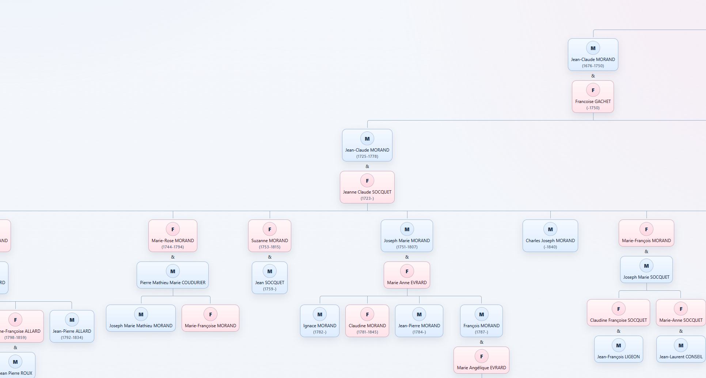

# GEDCOM to HTML Family Tree Converter

This project converts a GEDCOM file into a standalone HTML page that renders a CSS-based family tree.

## Features

- Imports people and family relationships from GEDCOM
- Exports a visual tree as `index.html`
- Includes built-in styling and default male/female avatars

## Project Layout

- `src/HtmlGenerator`: Windows Forms app and conversion logic
- `demo`: sample generated HTML and image assets

## Prerequisites

- Windows
- .NET Framework 4.8 SDK/runtime
- Visual Studio (for opening `src/FamilyTree.sln`)

## Usage

1. Open `src/FamilyTree.sln` in Visual Studio.
2. Build and run the `HtmlGenerator` project.
3. Select a GEDCOM file in the UI.
4. Enter the ancestor ID to center in the generated tree.
5. Click import to generate `index.html`.

## Credits

- CSS tree style inspired by [TheCodePlayer](http://thecodeplayer.com/experiment/css3-family-tree/)
- GEDCOM import logic inspired by [FamilyShow](https://familyshow.codeplex.com/)